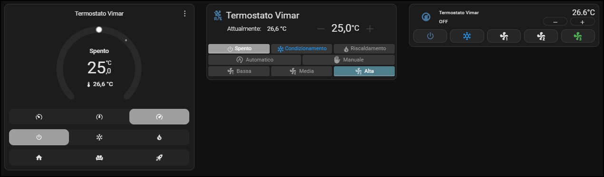

# Vimar KNX Climate

[](https://github.com/tempod/vimar-knx-climate/actions/workflows/validate.yml)
[](https://github.com/tempod/vimar-knx-climate/releases)
[](https://hacs.xyz)
[](https://www.home-assistant.io)
[](https://github.com/tempod/vimar-knx-climate/releases)
[](LICENSE)
[](https://github.com/tempod/vimar-knx-climate/issues)

Integrazione personalizzata per Home Assistant che crea una vera entità `climate`
a partire dagli indirizzi di gruppo e dai payload non standard dei termostati
Vimar su bus KNX.

I termostati Vimar (Well-contact, By-me KNX) non espongono un oggetto climate
conforme a DPT 20.102 / 20.105: la modalità, la stagione e la ventola viaggiano
su group address separati con payload proprietari a 1 byte, e i setpoint estivo,
invernale e automatico sono tre oggetti distinti. L'integrazione KNX ufficiale
non riesce quindi a produrre un `climate.*` utilizzabile.

Questa integrazione risolve il problema aggregando le entità KNX generiche
(`sensor`, `select`, `number`) in un'unica entità climate, con termostato
grafico, controllo vocale, e supporto per Google Home / Alexa / HomeKit.

## Architettura

```
knx.yaml (integrazione KNX ufficiale)        vimar_knx_climate
─────────────────────────────────────        ─────────────────
sensor.temp_attuale ──────────────────┐
select.modalita ──────────────────────┤
select.stagione ──────────────────────┼───►  climate.termostato_studio
select.ventola ───────────────────────┤
number.temp_estate/inverno/auto ──────┘
```

La connessione al bus resta interamente in mano all'integrazione KNX ufficiale.
Nessun secondo tunnel verso il gateway, nessuna dipendenza da API interne.

## Struttura del repository

```
CHANGELOG.md                           modifiche di ogni versione
custom_components/vimar_knx_climate/   il componente vero e proprio
  brand/                               icone e logo, chiaro e scuro
  translations/                        italiano e inglese
resources/
  icons/                               sorgenti SVG e script di generazione
  cards/                               configurazioni Lovelace e schermata
```

Solo `custom_components/` viene installato da HACS. `resources/` è materiale
di supporto: le card si copiano a mano in dashboard, gli script servono a
rigenerare le immagini.

## Installazione via HACS

1. HACS → menu in alto a destra → **Custom repositories**
2. `https://github.com/tempod/vimar-knx-climate`, categoria **Integration**
3. Cerca "Vimar KNX Climate", installa, riavvia Home Assistant
4. **Impostazioni → Dispositivi e servizi → Aggiungi integrazione → Vimar KNX Climate**

Installazione manuale: copia `custom_components/vimar_knx_climate/` in
`<config>/custom_components/` e riavvia.

### Dove appare la voce, e come ricaricarla

L'integrazione dichiara `"integration_type": "device"`, quindi compare in
**Impostazioni → Dispositivi e servizi → Integrazioni** con la card completa:
il menu ⋮ offre *Ricarica*, *Rinomina* ed *Elimina*, e *Configura* apre il flow
delle opzioni.

Attenzione se stai aggiornando da una versione precedente alla 0.2.1: lì il
manifest dichiarava `"helper"`, e le voci di quel tipo vengono elencate nella
scheda **Helper**, che non ha il comando di ricarica. Dopo l'aggiornamento
serve un riavvio di Home Assistant perché la voce si sposti nella scheda
Integrazioni.

In ogni caso una config entry si può sempre ricaricare da
**Strumenti per sviluppatori → Azioni** con `homeassistant.reload_config_entry`,
indicando come target l'entità climate o il dispositivo.

## Prerequisiti: entità KNX

Le entità sorgente devono esistere. Esempio funzionante (`knx.yaml`):

```yaml
sensor:
  - name: "Termostato Studio - Temp Attuale knx"
    state_address: "1/5/181"
    type: temperature
    sync_state: true

select:
  - name: "Termostato Studio - Modalita knx"
    address: "1/5/184"
    state_address: "1/5/192"
    sync_state: true
    payload_length: 1
    options:
      - { option: "Automatico", payload: 0 }
      - { option: "Manuale", payload: 1 }
      - { option: "A Tempo", payload: 5 }
      - { option: "OFF", payload: 6 }

  - name: "Termostato Studio - Stagione knx"
    address: "1/5/188"
    state_address: "1/5/171"
    sync_state: true
    payload_length: 1
    options:
      - { option: "Condizionamento", payload: 1 }
      - { option: "Riscaldamento", payload: 2 }

  - name: "Termostato Studio - Ventola knx"
    address: "1/5/182"
    state_address: "1/5/168"
    sync_state: true
    payload_length: 1
    options:
      - { option: "low", payload: 0x55 }
      - { option: "med", payload: 0xAA }
      - { option: "high", payload: 0xFF }

number:
  - name: "Termostato Studio - Temp Estate knx"
    address: "1/5/167"
    state_address: "1/5/187"
    min: 20
    max: 30
    step: 0.1
    mode: slider
    type: temperature

  - name: "Termostato Studio - Temp Inverno knx"
    address: "1/5/191"
    state_address: "1/5/189"
    min: 15
    max: 25
    step: 0.1
    mode: slider
    type: temperature

  - name: "Termostato Studio - Temp Auto knx"
    address: "1/5/180"
    state_address: "1/5/176"
    min: 15
    max: 35
    step: 0.1
    mode: slider
    type: temperature
```

> **Nota su `sync_state`.** Con `sync_state: init` lo stato viene letto solo
> all'avvio: se qualcuno tocca il termostato a muro e l'attuatore non invia
> spontaneamente sul bus, Home Assistant resta disallineato. `sync_state: true`
> legge all'avvio e poi ogni 60 minuti. Si può anche scrivere
> `sync_state: "every 15"` per un intervallo in minuti.

## Mappatura

| Concetto Home Assistant | Origine Vimar |
|---|---|
| `hvac_mode: off` | Modalità = `OFF` |
| `hvac_mode: heat` | Stagione = `Riscaldamento` (+ modalità ≠ OFF) |
| `hvac_mode: cool` | Stagione = `Condizionamento` (+ modalità ≠ OFF) |
| `preset_mode` | Modalità: `Automatico`, `Manuale`, `A Tempo` |
| `fan_mode` | Select ventola (`low` / `med` / `high`) |
| `current_temperature` | Sensore sonda |
| `target_temperature` | Setpoint attivo (vedi sotto) |

Il setpoint attivo viene scelto così: in modalità `Automatico` si usa
"Temp Auto"; altrimenti "Temp Estate" se la stagione è Condizionamento,
"Temp Inverno" se è Riscaldamento. Anche `min`, `max` e `step` seguono
l'entità number attiva, quindi lo slider cambia scala insieme alla stagione.

Riaccendendo da OFF viene ripristinato l'ultimo profilo usato (default
`Manuale`), perché il termostato non ha un concetto di "on" separato dal
profilo di funzionamento.

## Configurazione

Nel config flow selezioni le entità sorgente. Sono obbligatori solo il sensore
di temperatura e il select modalità, più almeno un setpoint; stagione, ventola
e setpoint automatico sono opzionali (se manca la stagione l'entità espone solo
`off` + `heat`).

I campi in fondo al form contengono le **etichette** delle opzioni dei select.
Devono corrispondere esattamente a quanto scritto in `knx.yaml`: se hai chiamato
l'opzione `Spento` invece di `OFF`, scrivilo lì. Tutto è modificabile in seguito
da **Configura** senza rifare l'integrazione.

## Icone di ventola e profili

Il frontend di Home Assistant disegna le icone di `fan_mode` e `preset_mode`
solo per un elenco chiuso di valori; qualsiasi altro valore diventa un pallino
grigio. La traduzione delle icone tramite `icons.json` non è supportata per la
piattaforma climate, quindi l'unica via è esporre i valori standard.

L'integrazione se ne occupa da sola, senza toccare `knx.yaml`.

**Ventola.** Le opzioni del select vengono normalizzate su `off`, `on`, `auto`,
`low`, `medium`, `high`. Riconosce sia le forme inglesi abbreviate (`med`,
`min`, `max`) sia quelle italiane (`bassa`, `media`, `alta`, `automatica`) sia
quelle numeriche (`1`, `2`, `3`, `v1`…). Sul bus viene comunque scritta
l'opzione originale. Le icone risultanti sono `mdi:fan-speed-1/2/3`.

**Profili.** Ogni profilo Vimar viene mostrato come un preset standard,
configurabile:

| Profilo Vimar | Default | Icona |
|---|---|---|
| Automatico | `home` | mdi:home |
| Manuale | `comfort` | mdi:sofa |
| A Tempo | `boost` | mdi:rocket-launch |

Gli altri valori disponibili sono `none`, `eco`, `away`, `sleep`, `activity`.
Scegliendo "Etichetta Vimar originale" il nome resta quello di `knx.yaml`, ma
senza icona. Se due profili finiscono sullo stesso preset standard la
traduzione viene disattivata per tutti e tre, per non perdere informazione, e
viene loggato un warning.

Il rovescio della medaglia: HA tradurrà i preset con i propri nomi ("Casa",
"Comfort", "Turbo") invece di "Automatico", "Manuale", "A Tempo". Se preferisci
i nomi originali alle icone, imposta tutti e tre su "Etichetta Vimar originale"
e disattiva la normalizzazione della ventola.

Per mostrare i profili sulla card, aggiungi la feature:

```yaml
type: thermostat
entity: climate.termostato_vimar_test
features:
  - type: climate-hvac-modes
  - type: climate-fan-modes
    style: icons
  - type: climate-preset-modes
    style: icons
```

### Icone davvero personalizzate

La card termostato integrata non permette di scegliere le icone: la mappa è
cablata nel frontend e non esiste alcun punto di estensione, né lato
integrazione né lato configurazione della card. Mappare i profili sui preset
standard è quindi un ripiego, e i simboli che ne escono (una casa, un divano,
un razzo) non descrivono granché un termostato.

Per icone vere serve una card di terze parti, che accetti nome e icona per
ogni singola modalità. Le configurazioni pronte sono in `resources/cards/`,
descritte più sotto in [Card di esempio](#card-di-esempio); le chiavi restano
i valori standard prodotti dalla mappatura, così la card integrata continua a
funzionare in parallelo.

Se invece disattivi la mappatura ("Etichetta Vimar originale" più
normalizzazione ventola spenta), nelle card usa le etichette di `knx.yaml`
(`Automatico`, `Manuale`, `A Tempo`, `med`) al posto dei valori standard.

## Consigli

Dopo aver creato l'entità climate, nascondi le entità KNX sorgente
(Impostazioni → Entità → Nascondi) per non duplicare i controlli in dashboard.
Restano funzionanti, ma spariscono dall'interfaccia.

Attributi extra esposti per debug: `vimar_modalita`, `vimar_stagione`,
`setpoint_attivo`.

## Diagnostica

Se una riga di comandi non compare sulla card (tipicamente la ventola), la
causa quasi sempre è che l'entità select sorgente non esiste o non espone
opzioni. All'avvio l'integrazione registra un warning esplicito nel log:
cerca `vimar_knx_climate` in **Impostazioni → Sistema → Log**.

Da **Strumenti per sviluppatori → Stati** controlla anche l'attributo
`options` del select: se manca, il problema è in `knx.yaml`, non qui.

Uno stato ancora `unknown` invece è normale prima che il termostato risponda
alla prima lettura sul bus, e non nasconde più i comandi.

## Card di esempio



Da sinistra: la card termostato integrata di Home Assistant, che funziona
senza aggiungere nulla; Simple Thermostat con nomi e icone personalizzati;
button-card nella versione compatta.

In `resources/cards/` ci sono tre configurazioni Lovelace pronte, che coprono
lo stesso termostato in tre modi diversi. Non sono necessarie per usare
l'integrazione: l'entità climate funziona con la card termostato integrata di
Home Assistant senza aggiungere nulla.

| File | Card | Componenti richiesti |
|---|---|---|
| `simple_thermostat_card.yaml` | Simple Thermostat | `simple-thermostat`, `card-mod` |
| `buttoncard_thermostat.yaml` | button-card sull'entità climate | `button-card` |
| `buttoncard_no_thermostat.yaml` | button-card sulle entità KNX grezze | `button-card` |

Tutti si installano da **HACS → Frontend**. `card-mod` serve solo per il
colore della stagione in Simple Thermostat: senza, la card funziona lo stesso
ma i pulsanti Condizionamento e Riscaldamento restano neutri.

### Perché le personalizzazioni sono quasi tutte CSS

La card termostato integrata non permette di scegliere le icone di
`fan_mode` e `preset_mode`: la mappa è cablata nel frontend e non esiste alcun
punto di estensione. Le due card di esempio aggirano il limite in modi
diversi, ma nessuna delle due richiede modifiche all'integrazione.

**Simple Thermostat** accetta un blocco `styles:` che viene iniettato nel
proprio shadow DOM, quindi la maggior parte degli interventi non ha bisogno di
`card-mod`. Il file di esempio lo usa per:

- rendere non cliccabili titolo e valore del setpoint, così premere sulla card
  non apre il termostato integrato;
- rendere Condizionamento e Riscaldamento soli indicatori, non selezionabili,
  per gli impianti in cui la stagione è commutata da una centrale;
- uniformare altezza dei pulsanti e scala delle icone sulle tre righe.

Due dettagli valgono la pena di essere segnalati, perché non sono ovvi:

- `tap_action: none` **non funziona** su Simple Thermostat. La card emette
  l'evento `hass-action` passando l'azione come oggetto invece che come
  stringa, quindi Home Assistant non trova la configurazione e ricade sul
  comportamento predefinito, cioè `more-info`. L'unico modo di bloccare quei
  click è `pointer-events: none` via CSS.
- L'altezza della riga hvac va forzata con `!important`, perché la card ha una
  regola interna più specifica (`.modes.hvac.sparse .mode-item`). Senza,
  servirebbe un selettore dedicato solo a quella riga.

**button-card** non ha questi problemi: `tap_action: none` funziona, e i
template JavaScript possono restituire perfino il nome del servizio e l'intero
oggetto `service_data`. È quello che permette a un solo pulsante di ciclare
Automatico → Manuale → Spento, attraversando due servizi diversi
(`climate.set_preset_mode` e `climate.turn_off`) con chiavi di dati diverse.

### Il colore della stagione

Entrambe le card colorano di arancione Riscaldamento e di azzurro
Condizionamento, e devono farlo anche a termostato spento. Non possono però
leggerlo da `hvac_mode`, che da spento vale `off` e non porta più
l'informazione.

La sorgente giusta è l'attributo **`vimar_stagione`** esposto
dall'entità climate, che riporta lo stato grezzo del select KNX. È un valore
per termostato, quindi le card si replicano cambiando solo l'`entity_id`, e
sui termostati di solo riscaldamento vale `null`, ricadendo correttamente sul
ramo del riscaldamento.

Entrambi i file evitano di scrivere l'entity_id dentro il template del colore:
Simple Thermostat usa `config.entity`, che `card-mod` mette a disposizione,
button-card usa `entity`, che nei suoi template è l'oggetto stato della card.

### Il grafico della temperatura

Le due card aprono la cronologia della sonda in due modi diversi, perché le
possibilità sono diverse:

- **button-card**: `hold_action` con `action: more-info` puntato al sensore di
  temperatura invece che al climate. Un tap lungo apre la finestra del sensore,
  che si presenta con il grafico storico.
- **Simple Thermostat**: un tap lungo non è ottenibile, perché l'unico handler
  di hold è sul valore del setpoint e passa dallo stesso dispatch difettoso
  descritto sopra. Si usa invece `current_value_entity`, che fa leggere la riga
  "Attualmente" direttamente dal sensore: il valore mostrato è identico, ma il
  click su quella riga apre il grafico del sensore anziché il termostato.

### La terza card

`buttoncard_no_thermostat.yaml` è la versione precedente all'integrazione, che
pilota direttamente le entità `select` e `number` generate da `knx.yaml`. È
inclusa come termine di paragone: fa le stesse cose in circa 250 righe contro
le 230 della versione su entità climate, ma soprattutto ripete in cinque punti
diversi la logica che decide quale setpoint toccare fra estate, inverno e
automatico. Sull'entità climate quella logica sparisce, perché
`attributes.temperature` punta già all'oggetto corretto.

## Marchio del progetto

Le immagini stanno in `custom_components/vimar_knx_climate/brand/`. Da Home
Assistant 2026.3 le integrazioni custom possono distribuire le proprie
immagini in questo modo, e i file locali hanno la precedenza sul CDN dei
brand: non serve aprire una pull request su `home-assistant/brands`.

| File | Dimensione | Usato quando |
|---|---|---|
| `icon.png` | 256×256 | tema chiaro |
| `icon@2x.png` | 512×512 | tema chiaro, schermi HiDPI |
| `dark_icon.png` | 256×256 | tema scuro |
| `dark_icon@2x.png` | 512×512 | tema scuro, schermi HiDPI |
| `logo.png` | 550×256 | tema chiaro |
| `logo@2x.png` | 1101×512 | tema chiaro, HiDPI |
| `dark_logo.png` | 550×256 | tema scuro |
| `dark_logo@2x.png` | 1101×512 | tema scuro, HiDPI |

Sorgenti SVG e script di generazione in `resources/icons/`. Per rigenerare
le immagini dopo una modifica ai colori o alla geometria:

```bash
pip install cairosvg pillow
python resources/icons/make_brand.py     # SVG -> resources/icons/
python resources/icons/render_brand.py   # PNG -> custom_components/.../brand/
```

I due script ricavano i percorsi da `__file__`, quindi si possono lanciare da
qualsiasi directory.

Su Home Assistant precedenti alla 2026.3 la cartella `brand/` viene ignorata e
compare l'icona generica. Per coprirle serve una pull request su
`home-assistant/brands`, che accetta le integrazioni custom nella cartella
`custom_integrations/<dominio>/` con gli stessi identici file.

## Marchi di terzi

Vimar® e KNX® sono marchi registrati dei rispettivi titolari. Questo progetto
non è prodotto, sponsorizzato né approvato da Vimar S.p.A. o dalla KNX
Association. I nomi sono usati unicamente per indicare con quali dispositivi
l'integrazione è compatibile.

L'icona e il logo sono disegni originali: non riproducono, non imitano e non
derivano da alcun marchio figurativo di terzi.

## Limiti noti

- Non è esposto `hvac_action` (riscaldamento/raffrescamento in corso): servirebbe
  un group address di stato del relè o della valvola. Se il tuo attuatore lo
  espone, si può aggiungere.
- I payload sono definiti in `knx.yaml`, non qui: questa integrazione non parla
  direttamente con il bus.

## Changelog

Le modifiche di ogni versione sono in [CHANGELOG.md](CHANGELOG.md).

## Licenza

MIT
